# Amazon Replica: A Massively Scalable Distributed Microservices E-Commerce Application


## Builds


## Table of Contents

1. [Project Overview](#project-overview)
2. [System Design](#system-design)
3. [Components](#components)
    - [Microservices, Databases, Caching & Design Patterns](#microservices-databases-caching--design-patterns)
        - [Users Microservice](#users-microservice)
        - [Transactions Microservice](#transactions-microservice)
        - [Merchants Microservice](#merchants-microservice)
        - [Notifications Microservice](#notifications-microservice)
        - [Search Microservice](#search-microservice)
    - [API Documentation](#api-documentation)
    - [Message Queues](#message-queues)
    - [Synchronous Communication](#synchronous-communication)
    - [API Gateway](#api-gateway)
4. [Observability](#observability)
    - [Dashboards](#dashboards)
    - [Metrics](#metrics)
    - [Logging](#logging)
    - [Tracing](#tracing)
5. [CI/CD](#cicd)
6. [Developing with Docker Compose](#local-development-with-docker-compose)
7. [Deployment to Kubernetes Local Cluster (Minikube)](#deployment-to-kubernetes-local-cluster-minikube)
8. [Testing](#testing)
9. [Contributors & Teams](#contributors--teams)
10. [License](#license)
11. [Credits](#credits)

## Project Overview

This project is a distributed microservices E-commerce application that allows merchants to list products and customers to purchase products using wallet, credit card (Stripe), or cash on delivery (COD), generate invoices, and admins to view sales reports for the system. 
The system is designed to be massively scalable, with each microservice handling a specific domain of the application. The architecture is built using Spring Boot for the backend, with various databases and caching mechanisms to ensure high availability and performance, and uses Kubernetes for a highly available and scalable deployment,
and is designed to be observability-first, with built-in support for metrics, logging, and tracing.

## System Design

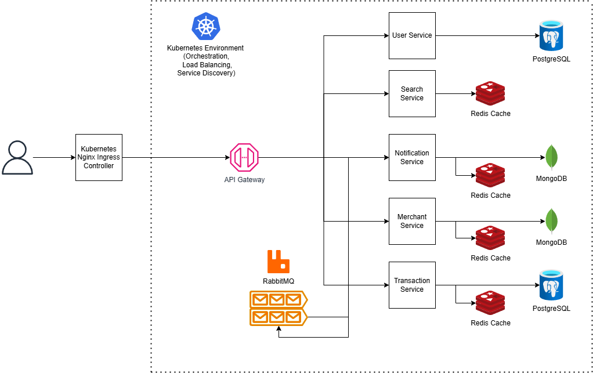

## Components

### Microservices, Databases, Caching & Design Patterns

<details id="users-microservice">
   <summary>
      👥 Users Microservice
   </summary>
   This microservice handles user CRUD operations, and auth functionalities like login, register (as customer, merchant, or admin), logout, and change password.
   It uses a PostgreSQL database for storing user data. It also uses Spring Security for authentication and JWT for token-based authentication. It applies the Strategy design pattern for using different login mechanisms (e.g. using mobile phone or email) dynamically based on the provided identifier, and the Builder design pattern for building user profiles for registration based on the user role.
</details>


<details id="transactions-microservice">
   <summary>
      💳 Transactions Microservice
   </summary>
   This microservice handles transactions, including creating orders, processing payments (using Stripe, wallet, or cash-on-delivery), and generating invoices. It uses a PostgreSQL database for storing transaction data and Redis for caching frequently accessed data.
   It notifies the Notifications microservice about confirmed orders and using RabbitMQ. 
   It applies the Command design pattern for processing payments and the Strategy design pattern for using different payment methods (e.g. Stripe, wallet, or cash-on-delivery) dynamically based on the provided payment method.
</details>


<details id="merchants-microservice">
   <summary>
      🚚 Merchants Microservice
   </summary>
    This microservice handles product management. It uses a MongoDB database for storing product data. It also uses Redis for caching frequently accessed data. It notifies the Notifications microservice about product quantity updates using RabbitMQ.
</details>


<details id="notifications-microservice">
   <summary>
      🔔 Notifications Microservice
   </summary>
    This microservice handles notifications, including sending email and in-app notifications to users. It uses RabbitMQ for asynchronous communication with other microservices, and Redis for caching frequently accessed data. It also handles user notification preferences, such as whether to receive email notifications or not, and what product stock threshold to notify the merchant about when the stock drops below.
</details>


<details id="search-microservice">
   <summary>
      🔎 Search Microservice
   </summary>
    This microservice handles search functionality for products. It currently uses no database, and uses Redis for caching frequently accessed data. It applies the Specification design pattern for building dynamic search queries based on user input, and the Strategy design pattern for using different sorting methods for the results based on the provided search criteria.

   In the future, it can be extended to use Elasticsearch for advanced, more optimized search capabilities.
</details>

<h3 id="api-documentation">📰 API Documentation</h4>

This project uses OpenAPI 3.0 for API documentation for each microservice. The API documentation is generated automatically from the code using the Springdoc OpenAPI library.

For example, the API documentation for the Users microservice is available at:

```
http://localhost:8085/swagger-ui/index.html
```

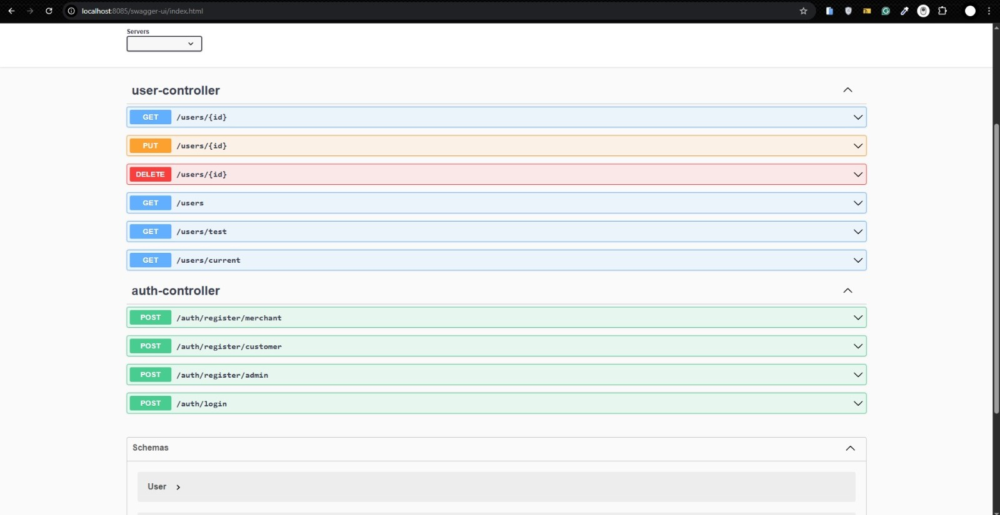

<h3 id="message-queues">📬 Message Queues (Asynchronous Communication)</h4>

This project uses RabbitMQ 🐰 as the message queue for asynchronous communication between microservices. Each microservice that needs to send or receive messages from the message queue has a dedicated RabbitMQ exchange and queue.

<h3 id="synchronous-communication">📡 Synchronous Communication</h4>

This project uses OpenFeign for synchronous communication between microservices. Each microservice that needs to communicate with another microservice declares an OpenFeign client to make HTTP requests to the other microservice's exposed API controller endpoints.

<h3 id="api-gateway">🌐 API Gateway</h4>

This project uses Spring Cloud Gateway as the API Gateway for routing requests to the appropriate microservice. The API Gateway is responsible for handling incoming requests, routing them to the appropriate microservice, and returning the response to the client.

It also handles cross-cutting concerns such as authentication and request/response transformation. It verifies the JWT token for authenticated requests, and forwards the request to the appropriate microservice based on the request path after attaching the extracted User ID and User Role from the JWT to the request headers, to be used by the microservices downstream.

<h2 id="observability">🔭 Observability</h4>

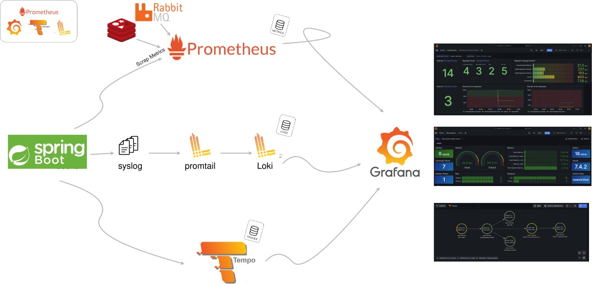

### Dashboards

This project uses Grafana for visualizing metrics, logs, and traces. It provides a unified way for monitoring the entire system. The dashboards are configured to display metrics from Prometheus, logs from Loki, and traces from Tempo.

<details>
  <summary>Spring Boot Microservices Dashboard</summary>

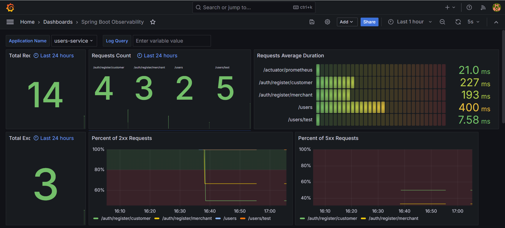
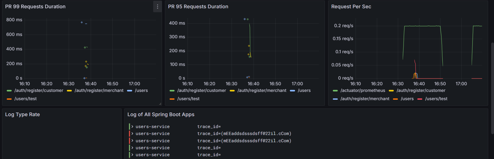
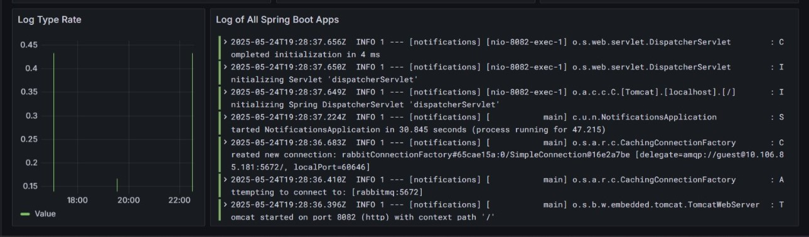

</details>

<details>
  <summary>Redis Dashboard</summary>

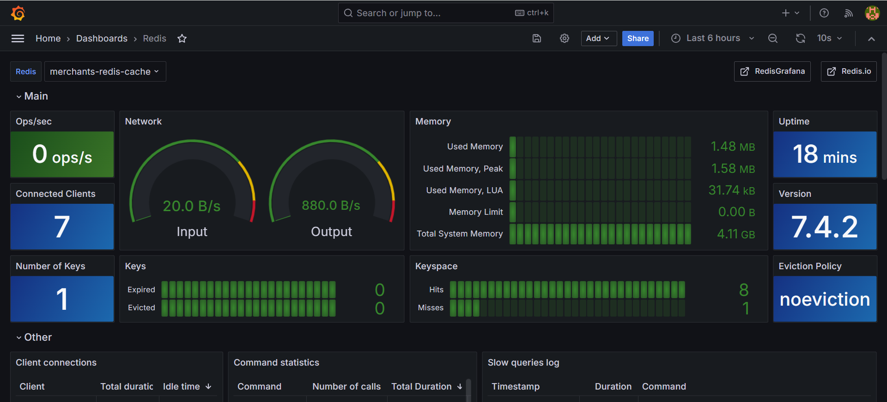
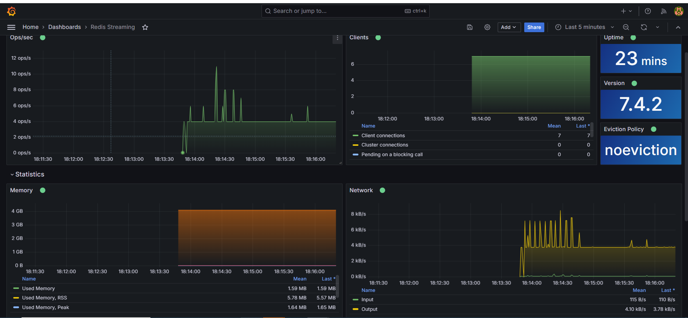

</details>

<details>
  <summary>RabbitMQ Dashboard</summary>


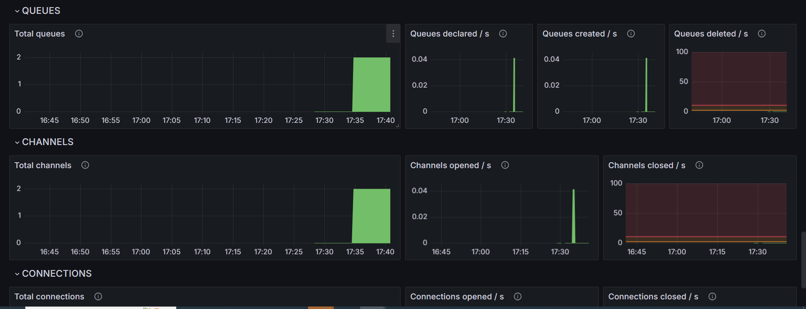

</details>

<details>
  <summary>Traces Dashboard</summary>

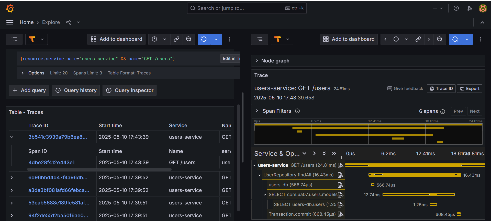
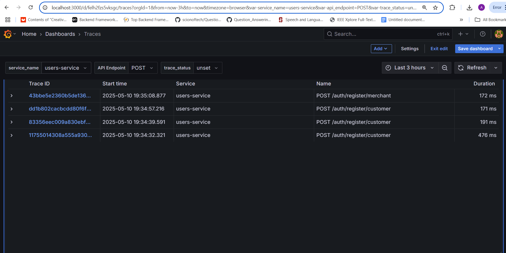
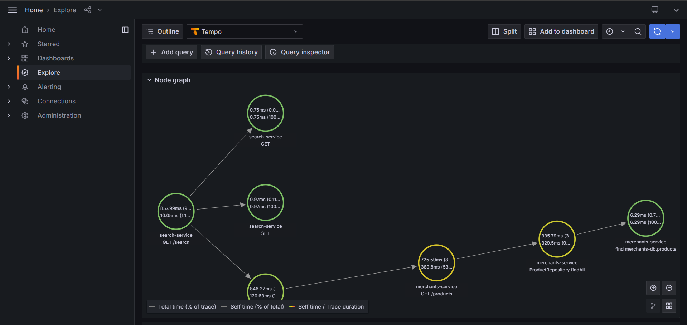

</details>

<details>
  <summary>Metrics to Traces</summary>

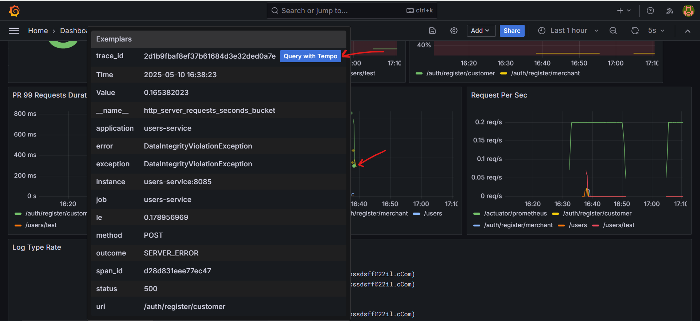

</details>


### Metrics

This project uses Prometheus for collecting and storing metrics from the microservices. Each microservice exposes a `/actuator/prometheus` endpoint that Prometheus scrapes to collect metrics.

### Logging

This project uses Grafana Loki for logging. In the Docker Compose environment, each microservice is configured to use the Loki Docker driver for logging, which sends logs to the Loki server. The logs can be viewed in Grafana.
In the Kubernetes environment, the Loki docker driver is replaced with Promtail, which is a log collector that sends logs to Loki.

### Tracing

This project uses OpenTelemetry for distributed tracing. Each microservice is instrumented with OpenTelemetry to collect traces and send them to the Tempo server. The traces can be viewed in Grafana.

<h2 id="cicd">🌟 CI/CD</h2>

This project uses GitHub Actions for continuous integration and continuous deployment (CI/CD). The CI/CD pipeline is defined in the `.github/workflows` directory.

All changes to the `main` branch require at least one approval from a code owner of the part(s) of the codebase that were modified, as defined in the `CODEOWNERS` file in the `.github` directory.

### Continuous Integration (CI) Pipeline

The CI pipeline is triggered on every push to the `main` branch and on pull requests. It checks out the code, sets up the JDK, and builds the project using Maven to ensure that the project builds successfully. Finally, it applies formatting to the code using Maven Spotless plugin to ensure that the code adheres to the project's coding standards.

### Continuous Deployment (CD) Pipeline

The CD pipeline is triggered on every push to the `main` branch. It does the following:
1. Builds the project using Maven.
2. Builds Docker images for each microservice that was changed and pushes them to our Docker Hub registry/repository.
3. Deploys the updated microservices to the Kubernetes cluster using the deployment files in the `k8s` directory.
4. Notifies the team via our Discord server about the deployment status, timestamp, commit, author and jobs.

    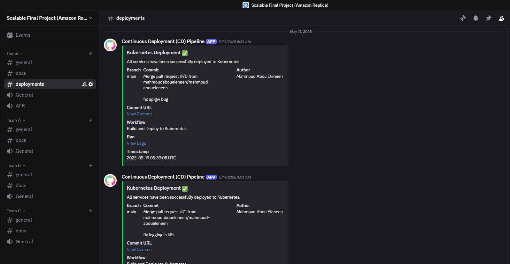

## Local Development with Docker Compose

This project uses Docker Compose to run the entire system locally for development purposes. In each microservice folder (e.g. `services/users`, `services/transactions`, etc.), there is a `docker-compose.yml` file that defines the service and its dependencies (e.g. its database, cache).
This can be used to run each microservice independently for development and testing purposes if the microservice does not depend on other microservices or on the message queue.

To run the entire system locally, you can use the provided `docker-compose.yml` file in the root directory of the project. This file defines all the services, databases, and message queue needed to run the application, also including the API Gateway and the observability stack (Prometheus, Grafana, Loki, Tempo).

The following commands are generally required for either case.

1. First, install the Docker plugin for Loki, which is used for logging.

    ```bash
    docker plugin install grafana/loki-docker-driver:2.9.2 --alias loki --grant-all-permissions
    ```

2. Then, build the project and start the services using Docker Compose.

    ```bash
    mvn clean install -DskipTests
    docker compose up -d --build
    ```

3. Install stripe cli from this [link](https://github.com/stripe/stripe-cli/releases/tag/v1.27.0) and add its path to your path environment variable on your operating system.
This is necessary to enable the Stripe payment functionality in the Transactions microservice, through a local Stripe sandbox.

4. After that, you can run the following command to start listening to Stripe events and forward them to the Transactions microservice webhook endpoint.
    ```
    stripe login
    stripe listen --forward-to localhost:8084/stripe/webhook
    ```
5. Copy the webhook secret that is printed in the terminal after running the previous command, and paste it in the `application.yml` file of the Transactions microservice in `services/transactions`.
6. Download the Postman collection from the `docs/postman` directory and import it into Postman.
7. Update the Postman collection's `host` variable in the `local` environment to the URL of the API Gateway or the Microservice you want to interact with.
8. When done, you can stop the services by running:

    ```bash
    docker compose down
    ```
   
<h2 id="deployment-to-kubernetes-local-cluster-minikube">🚀 Deployment to Kubernetes Local Cluster (Minikube)</h2>

This system is designed to be deployed on a Kubernetes cluster. The deployment files are located in the `k8s` directory. 

To deploy the system on a local Kubernetes cluster, we use Minikube. To set up Minikube, follow these steps:

1. Install Minikube by following the instructions on the [Minikube website](https://minikube.sigs.k8s.io/docs/start/).
2. Install Kubectl by following the instructions on the [Kubernetes website](https://kubernetes.io/docs/tasks/tools/).
3. Start Minikube by running the following command (you can adjust the memory and CPU according to your machine's specifications, but lower values may lead to issues or pods dying due to out of memory OOM errors):

   ```bash
   minikube start --driver=docker --memory=7000 --cpus=8
   ```
4. Run our deployment script to deploy the system to the Minikube (Note: This script is used instead of the `kubectl apply -f ./k8s/ -r` command as it does some additional setup work to set up the Stripe CLI sandbox and dynamically update the K8s secret with the Stripe webhook secret after its deployment):

   ```bash
   ./bash/deploy.sh
   ```
5. Expose the API Gateway service to access it from outside the cluster:

   ```bash
   minikube service apigateway-service
   ```
6. Copy the API Gateway URL that will be opened in your browser. This URL will be used to access the API Gateway and, consequently, the entire system.
7. Download the Postman collection from the `docs/postman` directory and import it into Postman.
8. Update the Postman collection's `host` variable in the `local` environment to the URL of the API Gateway you previously copied.
9. Expose the Grafana service to access it in your browser:
   
   ```bash
   minikube service grafana
   ```
10. Log in to Grafana using the default credentials:
    - Username: `admin`
    - Password: `admin`
11. When done, you can stop the Minikube cluster by running:

    ```bash
    minikube stop
    ```

<h2 id="testing">🧪 Testing</h2>

Our system is designed to be tested using JUnit 5 with Spring Boot Test.

Testing was done primarily using Postman, and the Postman collection is available in the `docs/postman` directory. The collection includes tests for each microservice's API endpoints, and it can be used to test the entire system end-to-end.

Unit Tests and Integration Tests are yet to be implemented for the microservices, but the system is designed to be easily testable using JUnit 5. Each microservice should have its own test suite, and the tests can be run using Maven.

## Contributors & Teams

This project is a collaborative effort of 15 extraordinary engineers split into 3 teams of 5, each responsible for different microservices and components of the system. 

See, additionally, the AUTHORS file for a list of the contributors to this project.

### Team A

This team is responsible for the Users Microservice, API Gateway, CI/CD, Observability, and Kubernetes deployment, service discovery, and load balancing.

- [Mahmoud Abou Eleneen (@mahmoudaboueleneen) - Scrum Master & Team A Leader](https://www.github.com/mahmoudaboueleneen)
- [Maya Khaled Saad (@mayaasaadd)](https://www.github.com/mayaasaadd)
- [Abdelrahman Abouelkheir (@abdelrahmanAbouelkheir)](https://www.github.com/abdelrahmanAbouelkheir)
- [Marwan Amgad (@marwanamgad)](https://www.github.com/marwanamgad)
- [Ahmed Sherif Said (@Ahmedsherif74)](https://www.github.com/Ahmedsherif74)

### Team B

This team is responsible for the Transactions and Notifications Microservices, as well as the Message Queues and the Caching for their microservices.

- [Ibrahim Soltan (@Ibrahim-Soltan) - Team B Leader](https://www.github.com/Ibrahim-Soltan)
- [Hamza Gehad (@Hamza-gehad)](https://www.github.com/Hamza-gehad)
- [Mohamed Ahmed Elfar (@mohamedahmedelfar)](https://www.github.com/mohamedahmedelfar)
- [Khaled Magdy (@khaledmagdy-oss)](https://www.github.com/khaledmagdy-oss)
- [Remas Osama (@RemasOsama)](https://www.github.com/RemasOsama)

### Team C

This team is responsible for the Merchants and Search Microservices, as well as the Caching for their microservices.

- [Ahmed Sherif (@AhmedSherif9) - Team C Leader](https://www.github.com/AhmedSherif9)
- [Mohamed Ahmed Aly (@mohamed-ahmed121)](https://www.github.com/mohamed-ahmed121)
- [Ahmed Hassaballah (@hassaballah17)](https://www.github.com/hassaballah17)
- [Kirollos Naguib (@kirollosn)](https://www.github.com/kirollosn)
- [Youssef Khawaga (@khawagaa)](https://www.github.com/khawagaa)

## License

This project is licensed under the GNU General Public License v3.0. See the [LICENSE](./LICENSE) file for more details.

## Credits

- [Workup - GitHub Repo](https://github.com/Ahmad45123/workup/blob/main/README.md)
- Architecture of Massively Scalable Applications course, the German University in Cairo
