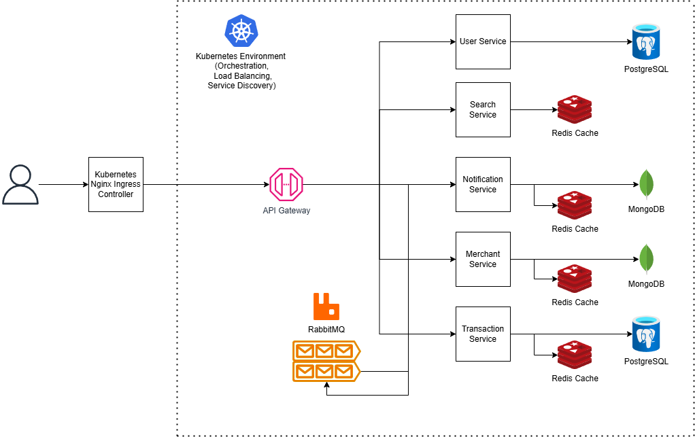

# Amazon Replica: A Massively Scalable Distributed Microservices E-Commerce Application.

[//]: # (![Loki]&#40;https://img.shields.io/badge/Loki-FFCB2B.svg?style=for-the-badge&logo=grafana-loki&logoColor=black&#41;)

[//]: # (![Tempo]&#40;https://img.shields.io/badge/Tempo-3B4EFF.svg?style=for-the-badge&logo=grafana-tempo&logoColor=white&#41;)

## System Architecture

## Contributors

